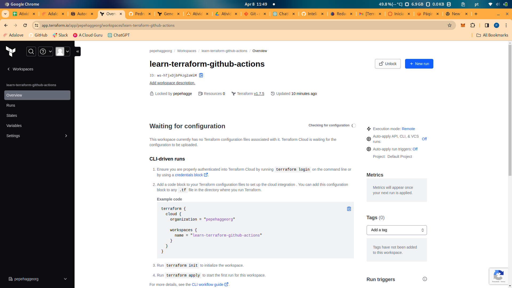
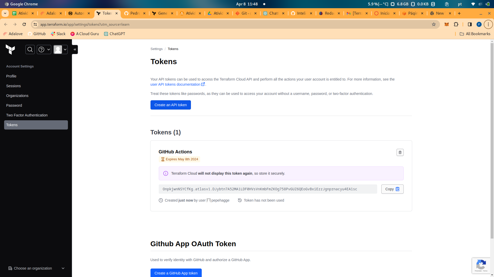
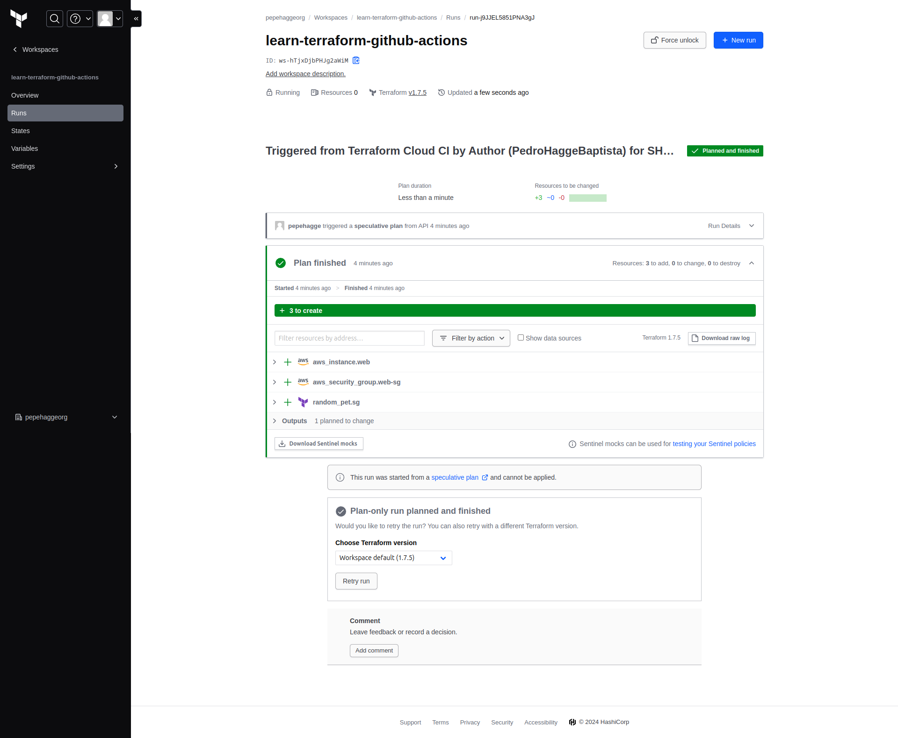
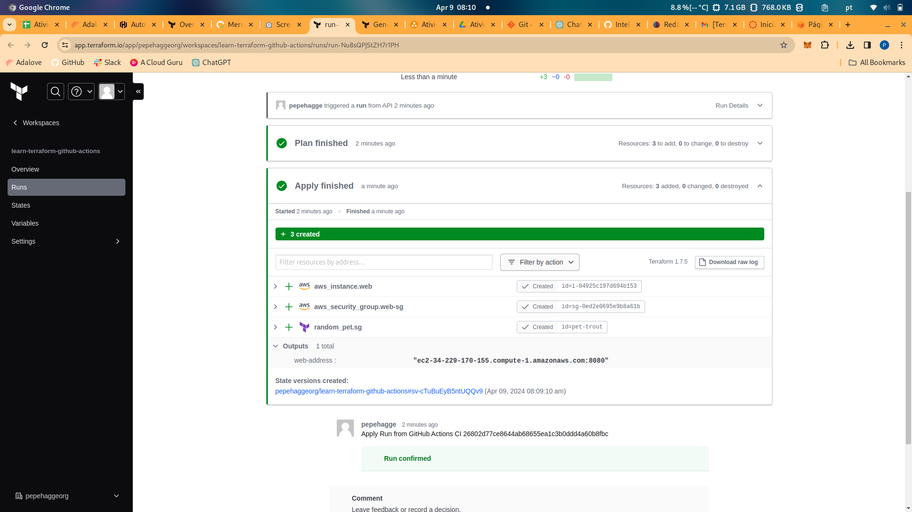
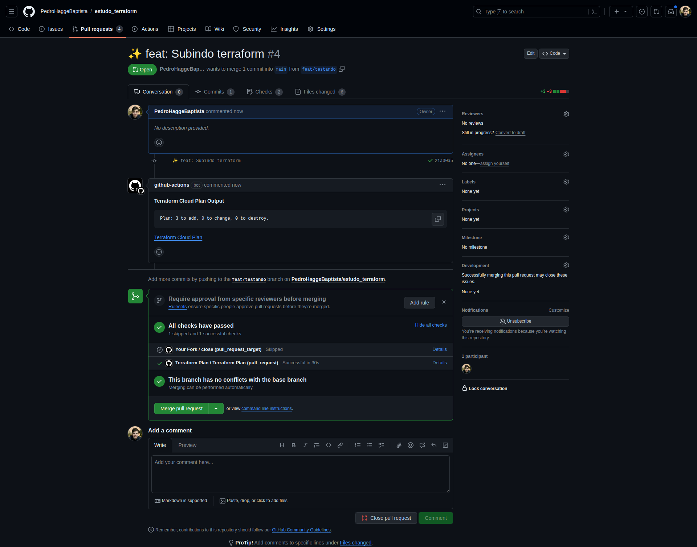
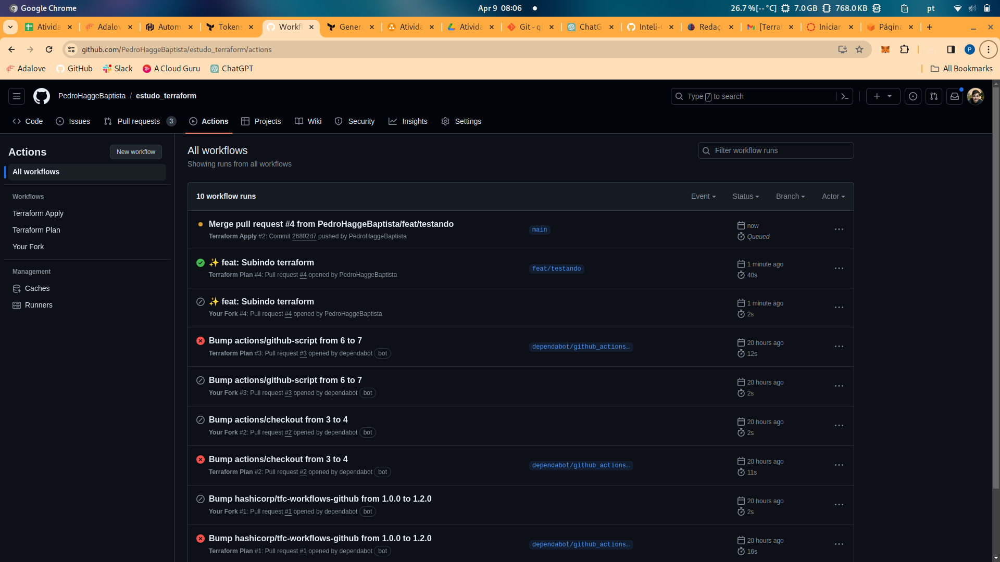
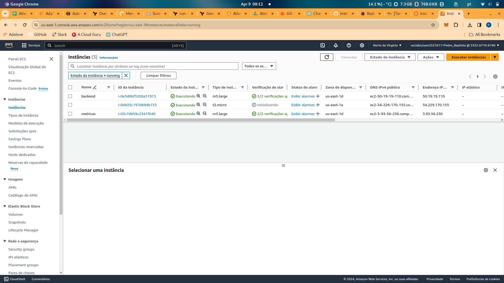

# Relatório sobre Terraform e Automação com GitHub Actions

## Introdução

[Terraform](https://www.terraform.io/) é uma ferramenta de infraestrutura como código (IaC) desenvolvida pela HashiCorp. Ela permite aos usuários definir e provisionar a infraestrutura de um datacenter usando uma linguagem de configuração de alto nível. Terraform pode gerenciar provedores de serviços em nuvem, bem como recursos locais.

## Conceitos Aprendidos

### Infraestrutura como Código (IaC)

IaC é uma prática que envolve o gerenciamento e provisionamento de infraestrutura através de arquivos de configuração, em vez de configuração manual de hardware. Isso permite uma automação mais eficiente e consistente na criação e manutenção de ambientes.

### Declaração de Recursos

Em Terraform, a infraestrutura é definida em arquivos de configuração usando uma sintaxe declarativa. Isso significa que você descreve o estado desejado da sua infraestrutura, e o Terraform se encarrega de alcançá-lo.

### Provedores

Terraform suporta uma ampla gama de provedores de serviços em nuvem, como AWS, Azure, Google Cloud e outros. Cada provedor oferece recursos específicos que podem ser gerenciados através de Terraform.

### Estados

O estado de Terraform é um registro do estado atual da infraestrutura gerenciada. Ele é usado para determinar as mudanças necessárias para alcançar o estado desejado definido nos arquivos de configuração.

### Automação com GitHub Actions

GitHub Actions é uma ferramenta de automação que permite criar fluxos de trabalho para automatizar o processo de desenvolvimento de software. No contexto de Terraform, é possível usar GitHub Actions para automatizar o processo de provisionamento e gerenciamento da infraestrutura.

## Exemplo de Uso

No tutorial seguido, é demonstrado como usar Terraform junto com GitHub Actions para automatizar o provisionamento de infraestrutura na AWS. O fluxo de trabalho inclui etapas como:

- Instalação do Terraform.
- Inicialização do Terraform.
- Validação dos arquivos de configuração do Terraform.
- Aplicação das mudanças para provisionar a infraestrutura.

## Prints de Execução

## Conclusão

Terraform é uma ferramenta poderosa para gerenciar infraestrutura como código, oferecendo flexibilidade e automação no provisionamento de recursos. A integração com GitHub Actions permite automatizar ainda mais o processo, tornando o gerenciamento de infraestrutura mais eficiente e consistente.